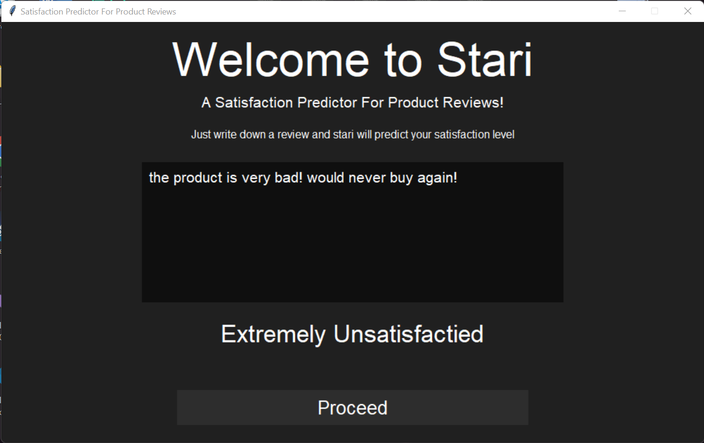

# Product Satisfaction Predictor

#### NOTE: DOWNLOAD THE DATASET REQUIRED FROM [HERE](http://jmcauley.ucsd.edu/data/amazon/index.html) AND PLACE IT INTO A FOLDER INSIDE THE FOLDER OF THE PROJECT!

>An Artificially Intelligent Product Satisfaction Predictor created in 2022 as a project for my NLP course in the British University in Dubai.

>Python and deep learning algorithoms are used to predict the satisfaction level from a product review.

>Concepts from natural language processing, deep learning, and neural networks were used in this project.

>A GUI is used to display the input and the output of the program.

>A minimalistic design, similar to the design of the [Minimalist Music Aggregator](https://github.com/Mayonaka88/minimalist-music-aggregator), was implimented.

>The user writes thier review and the program predicts what thier satisfaction level would be based on the emotions presented in thier review.

## Methodology

>Python was chosen to program the model and the graphical user interface. For this project, the NLTK and the Tkinter packages were mainly used. The NLTK package is a package designed to process natural language and is used in many natural language processing applications. The package offers many implementations such as tokenization and models such as the Naïve Bayes classifier and many more. In this project, 3 models will be tested. These models are the Naïve Bayes Classifier, the Maxent Classifier, and the Decision Tree Classifier. For the graphical user interface, the Tkinter package was used. The Tkinter package is a python package that creates a simple and functional graphical user interface. The Tkinter package creates canvases that can be customizable to include everything necessary for this project. It provides the necessary told to create a functionally and effective graphical user interface that can receive the input from the user and present the output of the model.

>The data used for this project is an open-source library of millions of Amazon product reviews. Created by Jianmo Ni, the Amazon Review Dataset contains 233.1 million reviews and it encompasses a wide variety of categories from food reviews to movie reviews. The dataset also offers many metadata that can be used in a multitude of applications. The type of data available in this dataset includes product reviews, the reviewer’s name, the product in question, the size of the product, the manufacturer, the color options of the product, and many more information. For this project, the data that will be focused on is the review itself and the rating. The rating will be used as a scale of how satisfied or unsatisfied the customer is with the product while using the review itself to train the model using natural language processing techniques. The category that will be used for this program is the food category since food reviews are some of the most polarizing reviews out there which should give the program the data required to detect the sentiment of the customer. 

>First, all the required packages that are going to be used to create the model are imported. These include the NLTK package for creating the model, the Pandas package for creating the data frames, and the JSON and gzip packages for importing the data.

>Then, the data gets extracted from the JSON file. This uses functions from the gzip and JSON packages. The gzip package is used to open the zip folder the JSON file is in and the JSON package loads the data from the file. All of this is performed in a function named parseData().

>After that, another function called getDF() is created to save the data frame. This function uses the Pandas package to create the data frame while calling the parseData function and using it to get the data that will be used to create the data frame.

>After creating these two functions, the program is ready to use these functions to load the data that is going to be used. First, the data gets loaded into the variable called reviews, and then, using that, a sample data frame is created.

>After the data has been loaded into the program, categories should be established. The sample data frame is then divided into 5 unique data frames based on the categories. These categories are based on the rating of the products. Each data frame represents a star rating from one to five.

>Then, these data frames are converted into string arrays. These string arrays will be used for pre-processing the data and training the model. The first phase in pre-processing is turning all the words into lowercase to avoid any bias when capitalization is involved. 

>Next, a tokenizer is created. This tokenizer is then used on all the string arrays that have been created. After the words have been tokenized, the punctuations present in the string arrays are then stripped away. This results in pre-processed and filtered string arrays.

>After the string arrays have been tokenized and stripped away from their punctuation, a function is created to obtain the features in the string arrays. The function is called word_features() and it returns the word features of a given string. 

>Next, the word_features() function is used on the string arrays and is saved in arrays of its own. Using a for loop, the function previously mentioned is called and the features of the word are extracted. Then, all of the features will be joined together into one array and that array will be used to train and validate the model. The array is also shuffled to avoid bias. 

>After all of that is done, the data is ready to be divided into training and testing data sets. First, the 80 to 20 ratio is calculated using the length of the array. This can be achieved by using the len() function multiplied by 0.8. After obtaining the ratio, it is then used to split the data.

>After the data has been split, it is time to train the models. As mentioned above, the models that have been trained are the Naïve Bayes Classifier, the Maxent Classifier, and the Decision Tree Classifier. The results of the training will be discussed later on.

>After the models have been trained, the best one is selected and used for the implementation of the satisfaction predictor. The next step is creating the graphical user interface. In this part, the Tkinter package is used. First, the package is imported. Then, a canvas is created.

>Next, a welcome message is created by labels and it includes instructions on how to use the program. An input box is also created so that the user can write their review in it.

>After that, a button is created which will call a function that will take the input from the user and then run it through the selected model which will print out the result. The function printReview() is the function created for this function. It takes the input and then uses the model to get the prediction. After the prediction is obtained, and if statement is used to print out the satisfactory level.

>The figures below show the application in action. Different scenarios are presented, and the real accuracy of the models can be clearly observed. 

### Application:

>

### Extremely Satisfied Outcome:

>

### Satisfied Outcome:

>

### Neutral Outcome:

>

### Unsatisfied Outcome:

>

### Extremely Unsatisfied Outcome:

>

